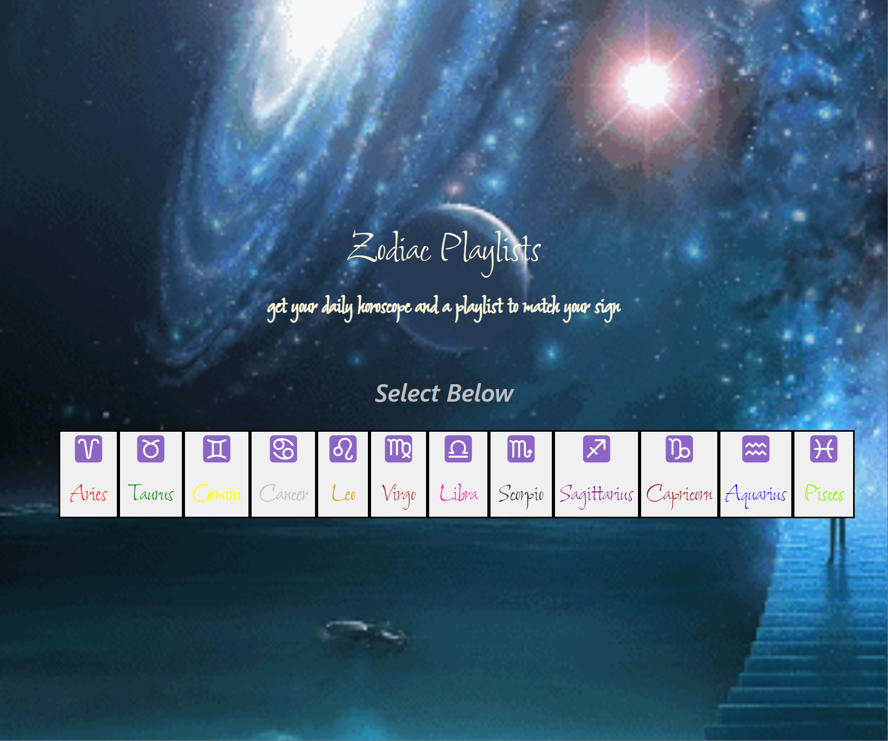

# Group One Collab 

## Description

<!-- Provide a short description explaining the what, why, and how of your project. Use the following questions as a guide:

- What was your motivation?
- Why did you build this project? (Note: the answer is not "Because it was a homework assignment.")
- What problem does it solve?
- What did you learn? -->

The team collaborated to discover a real world problem:

-As a user, I would like to select my astrological sign and find a playlist attached.

The developers found a free horoscope API for usage, and added the YouTube API to produce playlist links into the cards to be displayed when the user selects their zodiac.

<!-- ## Table of Contents (Optional)

If your README is long, add a table of contents to make it easy for users to find what they need.

- [Installation](#installation)
- [Usage](#usage)
- [Credits](#credits)
- [License](#license) -->

## Installation

<!-- What are the steps required to install your project? Provide a step-by-step description of how to get the development environment running. -->

To access the project, you will need an active internet connection. Once on the site, a user clicks their astrological sign. Hovering over a zodiac button with your mouse will show the date ranges for the zodiac. On clicking on the zodiac, a playlist link displays on the page.

## Usage

<!-- Provide instructions and examples for use. Include screenshots as needed.

To add a screenshot, create an `assets/images` folder in your repository and upload your screenshot to it. Then, using the relative filepath, add it to your README using the following syntax: -->

On opening the site, the user is presented with a dynamic page featuring buttons to click based on the selected zodiac sign:

 

Once a zodiac is clicked (in this case, Cancer), a playlist link is displayed, an image with some attributes of the sign, and the daily horoscope:

## Credits

<!-- List your collaborators, if any, with links to their GitHub profiles.

If you used any third-party assets that require attribution, list the creators with links to their primary web presence in this section.

If you followed tutorials, include links to those here as well. -->

Menelik Agared: https://github.com/menelik08
Abdi Aden: https://github.com/aaden9
Daniel Nelson: https://github.com/afredknot
Lindsay Klug: https://github.com/LindsayK82

Free API for horoscope: any.ge/horoscope/free-api
YouTube API: developers.google.com/youtube/v3
Tutorial resources: StackOverflow; Mozilla Development Docs

## License

---

MIT License

Copyright (c) 2022 Lindsay

Permission is hereby granted, free of charge, to any person obtaining a copy
of this software and associated documentation files (the "Software"), to deal
in the Software without restriction, including without limitation the rights
to use, copy, modify, merge, publish, distribute, sublicense, and/or sell
copies of the Software, and to permit persons to whom the Software is
furnished to do so, subject to the following conditions:

The above copyright notice and this permission notice shall be included in all
copies or substantial portions of the Software.

THE SOFTWARE IS PROVIDED "AS IS", WITHOUT WARRANTY OF ANY KIND, EXPRESS OR
IMPLIED, INCLUDING BUT NOT LIMITED TO THE WARRANTIES OF MERCHANTABILITY,
FITNESS FOR A PARTICULAR PURPOSE AND NONINFRINGEMENT. IN NO EVENT SHALL THE
AUTHORS OR COPYRIGHT HOLDERS BE LIABLE FOR ANY CLAIM, DAMAGES OR OTHER
LIABILITY, WHETHER IN AN ACTION OF CONTRACT, TORT OR OTHERWISE, ARISING FROM,
OUT OF OR IN CONNECTION WITH THE SOFTWARE OR THE USE OR OTHER DEALINGS IN THE
SOFTWARE.